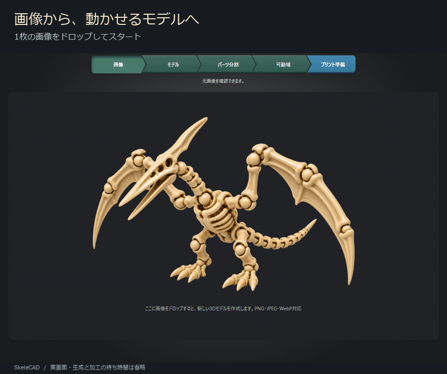

# SkeleCAD

**1枚の画像から、自由に動く3Dプリントモデルを生成！**



## できること

- **画像から3Dモデルを作る** — PNG・JPEG・WebPをドロップして生成。
- **好きな位置でパーツを分ける** — マーカーで分割位置を調整。左右対称の指定にも対応。
- **関節を動かして確かめる** — ボールジョイントを自動加工し、曲げ・ねじり・食い込みを確認。
- **加工を待ちながら確認する** — 前回確定した形状を表示し、未変更の関節は処理中も操作。
- **プリントに持ち込む** — 準備済みのモデルをBambu Studioで開く。

## 使い方

| 工程 | やること |
| --- | --- |
| **画像** | 画像をドロップ。AIが3Dの外観を生成します。 |
| **モデル** | 形を確認し、必要なら左右対称化します。 |
| **パーツ分割** | 分けたい位置にマーカーを置きます。関節の加工はバックグラウンドで進みます。 |
| **可動域** | パーツをドラッグして曲げたり、ねじったりして確認します。 |
| **プリント準備** | 準備済み3MFをBambu Studioで開きます。スライスと印刷はBambu Studioで行います。 |

工程の矢羽根をクリックすると、前の工程にも戻れます。

### 基本操作

| 操作 | 動き |
| --- | --- |
| パーツの中央付近をドラッグ | 関節を曲げる |
| パーツの外側を円を描くようにドラッグ／Shift＋ドラッグ | 関節をねじる |
| 背景をドラッグ | 視点を回す |
| 中ボタンでドラッグ／ホイール | 平行移動／拡大・縮小 |

## はじめる

Windowsと、CUDA対応のNVIDIA GPUが必要です。Bambu Studioをインストールしてください。

| ツール | 用途 | ダウンロード |
| --- | --- | --- |
| Bambu Studio | プリント準備・スライス・印刷 | [公式ダウンロード](https://github.com/bambulab/BambuStudio/releases/tag/v02.08.02.61) |

FreeCADとAI実行環境は初回起動時に自動で準備します。

リポジトリを取得・展開したフォルダーで、PowerShellから次の1行を実行します。

```powershell
powershell -ExecutionPolicy Bypass -File .\start.ps1
```


## ライセンス

[MITライセンス](LICENSE) · [ライセンス・クレジット](THIRD_PARTY_NOTICES.md)
